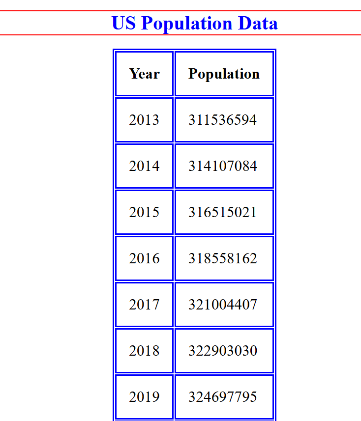

# US Census Data (Assignment 2)
CS 3980 Assignment 2 

This is assignment 2 for CS3980 Spring 2026 at the University of Iowa. The goal of this assignment is to create a webpage containing US population data.

US Census API Endpoint: https://api.datausa.io/tesseract/data.jsonrecords?cube=acs_yg_total_population_5&measures=Population&drilldowns=Year

The following code was borrowed/used for reference: 

[Link to Instructor's Github](https://github.com/changhuixu/CS3980-2026/tree/main/Module06)

[Link to Website Reference](https://developer.mozilla.org/en-US/docs/Web/API/Fetch_API/Using_Fetch)

[Link to Website Reference](https://www.w3schools.com/html/html_css.asp)

[Link to Website Reference](https://www.w3schools.com/jsref/prop_html_innerhtml.asp)

[Link to Website Reference](https://www.geeksforgeeks.org/html/html-table-align-attribute/)

AI was also used for background information.